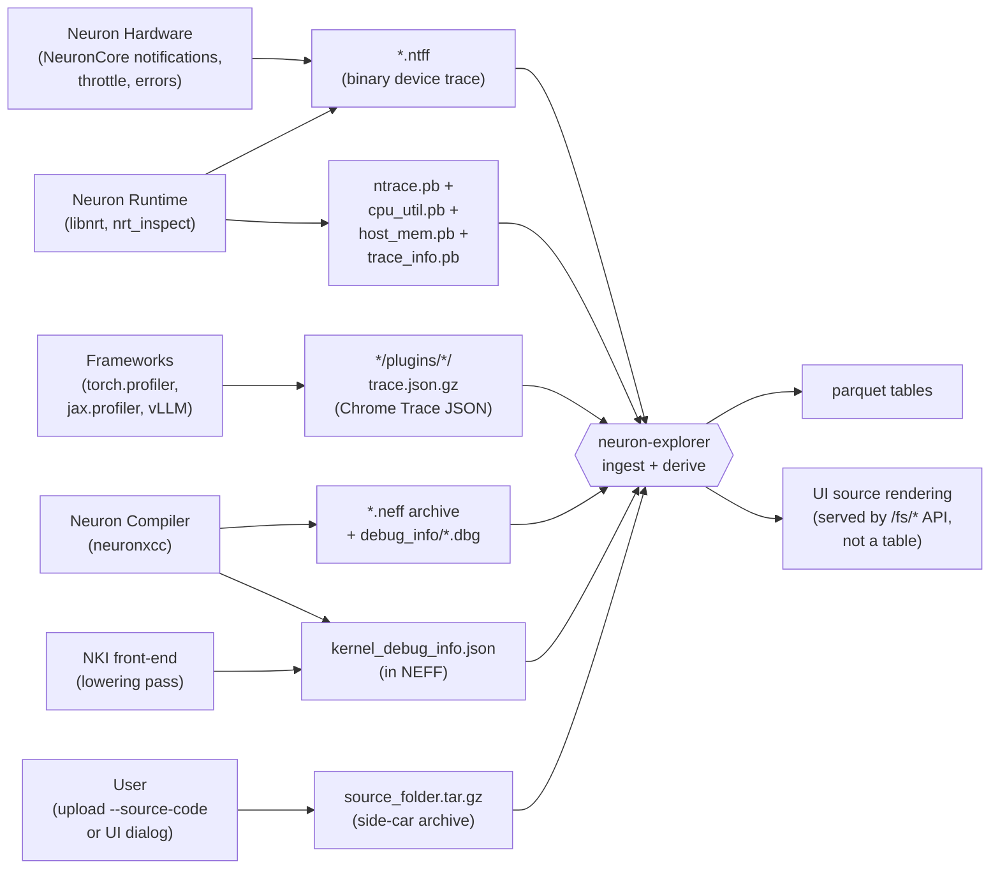

# Neuron Explorer Profile Schema

The neuron-explorer profile schema is the OpenAPI-typed contract for the
parquet tables produced when a profile is ingested. This skill is a starting
point — the schema evolves with each `neuron-explorer` release, so always
fetch the version that matches your installed CLI before relying on field
names or types.

## When to use this skill

- You need to know what tables exist and what each one represents.
- You need to look up fields, units, types, or enum values for a specific
  table.
- You need to find which fields relate to a topic (matmuls, source lines,
  HBM, semaphores, etc.).
- You want to understand where the values in a table come from (which input
  artifact, which producer in the Neuron stack).

For running queries against an ingested profile, use
`/neuron-nki-profile-querying`. For capturing a profile, use
`/neuron-nki-profiling`.

## Profile output format guidance: prefer Parquet over JSON

When using `neuron-explorer view` avoid using the legacy `--output-format json`
because it is disorganized, incomplete, poorly documented, and not scalable.
The default output format is Parquet. Parquet is a columnar and efficiently encoded
format, so producing/manipulating/analyzing Parquet is fast even for large profiles.
The neuron-explorer UI reads from the same Parquet, so what you query
matches what the UI shows.

Also, note that `--output-format summary-json` maps to the data in the
`Summary.parquet` table — same fields, same values. Prefer the default, full Parquet
output over `summary-json` because it takes about the same time to produce
and contains more information.

## Get the schema for your installed neuron-explorer

The schema is embedded in the `neuron-explorer` binary. To dump it:

```bash
neuron-explorer --show-profile-schema | \
    scripts/write_profile_schema_to_separate_yaml_files.py --out ./schema
```

`--show-profile-schema` prints all per-table YAML files concatenated with
`---` separators. The bundled helper script splits the stream into one file
per table, naming each by the top-level YAML key (`Instruction.yaml`,
`Summary.yaml`, etc.). The OpenAPI root document is written to
`schema.yaml`.

**Pitfall:** an outdated local copy of the schema causes confusing analysis
errors — fields renamed/removed, new columns missing, enums out of sync.
Re-fetch the schema any time you upgrade `neuron-explorer` or switch
between hosts with different versions installed.

## Quickly scan the schema

You can string search across the entire profile schema by searching in the YAML files dumped above (no profile needed):

```bash
# List every table and its description
grep -A1 -E '^[A-Z][A-Za-z]+:$' ./schema/*.yaml | grep -E '^(./schema|--|.*description:)' | head -40

# All fields whose name or description mentions "matmul" or "MATMUL"
grep -inE 'matmul' ./schema/*.yaml

# All fields that link to source code (file/line/function/stack)
grep -inE 'stack_frame|source_location|source_line|file_path|line_number|function_name|kernel_file|kernel_line' ./schema/*.yaml
```

Alternatively, the same schema information can be obtained in the `SchemaFields` table. After processing a profile the `SchemaFields.parquet` table will exist in the profile output. This table is self-describes the entire profile schema (same as the YAML, but as a queryable table). Each row describes a `(table, field)` with type, description, unit, format, requiredness, min/max, and enum values. You can either query the `SchemaFields` table using DuckDB SQL or via the API server after ingesting any profile (more details on both methods are documented in the `/neuron-nki-profile-querying` skill):

```bash
curl -s -X POST http://localhost:3002/api/v1/db/${PROFILE_NAME}/_search \
    -H 'Content-Type: application/json' \
    -d '{"type":"databaseExplorerQuery","tableName":"SchemaFields",
         "query":"SELECT table_name, field_name, field_description, field_unit
                  FROM SchemaFields WHERE field_name ILIKE '\''%matmul%'\''"}' \
    | python3 -m json.tool
```

## Modalities — kinds of data in the profile

Every table is one of the following modalities. Knowing the modality tells
you how to read the rows.

| Modality | What a row is | Examples |
|---|---|---|
| Timeline of events | One row per discrete event with `start_ts`/`end_ts` (or single `timestamp`) | `Instruction`, `DmaPacket`, `DmaPacketAggregated`, `ActiveTime`, `SemaphoreUpdate`, `Throttle`, `Error`, `CcOp`, `CoreBarriers`, `SystemProfileEvents`, `SbufAllocation` |
| Time-series samples | One row per sampled tick on a time axis | `DmaUsage`, `HbmUsage`, `PsumUsage`, `SbufUsage`, `PendingDma`, `CpuUsage`, `HostMemUsage`, `SystemProfileHbmUsage` |
| Dependency graph edges | One row per directed edge between rows in timeline tables (e.g. an instruction → the DMA it triggered) | `Flow` |
| Hierarchical aggregation | One row per node in a compiler IR hierarchy (Framework → HLO → Penguin → BIR → Instruction) with rolled-up statistics | `FrameworkInstruction`, `HloInstruction`, `PenguinInstruction`, `BirInstruction`, `FrameworkNode` |
| Aggregated summary | Computed roll-up across the whole profile (or by a key) | `Summary`, `OpcodeSummary`, `ThrottleSummary`, `HbmUsageSummaryByType` |
| Reference / lookup | Static dimension table referenced by other rows via foreign keys | `TensorInfo`, `DmaQueuesInfo`, `CcStream`, `StackFrame`, `StackFrameFileLocation`, `StackFrameFunctionName`, `StackFrameFileName`, `KernelStackFrames`, `KernelIterationVariables`, `KernelInstructions`, `AssemblyInstruction`, `DeviceProfileList` |
| Profile-level metadata | Single-row table describing the profile as a whole | `Metadata`, `NeffHeader`, `SystemProfileMetadata`, `ExecutionInfo` |
| Diagnostic messages | One row per warning emitted by `neuron-explorer` during ingestion. Always check this table first because rows can indicate a data quality problem. | `Warning` |
| Transient API response | Computed at query time and returned via the HTTP API; **not** written to parquet | `MemoryBandwidthPoint`, `MemoryBandwidthSeries`, `MemoryBandwidthResponse` |
| Enum | String enum referenced by other tables; not a standalone parquet table | `DmaQueueType`, `ErrorType`, `PerformanceMode`, `MemoryBandwidthDirection` |

## Data flow at a glance

Knowing where data originates helps when the schema description doesn't
fully answer a question — you can chase the field back to the producer's
source code.



Producer → input artifact → `neuron-explorer` -> output data table:

| Producer | Input artifact | Output Data Tables |
|---|---|---|
| Neuron Hardware | `*.ntff` (binary device trace) | `Instruction`, `DmaPacket`, `SemaphoreUpdate`, `Throttle`, `Error`, `CoreBarriers`, etc. |
| Neuron Runtime | `ntrace.pb` + `cpu_util.pb` + `host_mem.pb` + `trace_info.pb` (host protobuf) | `SystemProfileEvents` (`trace_event_source = neuron_rt` / `neuron_hw`), `CpuUsage`, `HostMemUsage`, `SystemProfileMetadata`, etc. |
| Frameworks (PyTorch, JAX, vLLM) | `*/plugins/*/trace.json.gz` (Chrome Trace JSON) | `SystemProfileEvents` (`trace_event_source = framework`) |
| Neuron Compiler — model | `*.neff` archive (header, tensor + queue manifest) | `NeffHeader`, `TensorInfo`, `DmaQueuesInfo`, `Metadata`, etc. |
| Neuron Compiler — debug info | `<neff>/debug_info/{framework,hlo,penguin,backend}.dbg` + `stack_frame_index.dbg` | IR hierarchy `FrameworkInstruction` → `HloInstruction` → `PenguinInstruction` → `BirInstruction`, plus `FrameworkNode` and the four `StackFrame*` tables |
| NKI front-end | `<neff>/kernel_debug_info.json` + per-kernel JSON | `KernelInstructions`, `KernelStackFrames`, `KernelIterationVariables`, `Instruction.nki_source_location` |
| User upload | `source_folder.tar.gz` (gzipped tar of `.py` files) | Not in any table — served by the `/fs/*` API for UI source rendering |

## Source code linking

A profile is most useful when trace data can be traced back to
the user code that produced it. The schema captures four distinct kinds of
"user code" attribution. Knowing which one(s) your
profile has tells you what attribution queries will actually return data.

### 1. Framework op hierarchy string (compiled flows)

Where the op sits in the model: a slash-separated path of `nn.Module`
names from the model root down to the op (e.g.
`GPT2Model[model]/Attention[attn]/Linear[q_proj][2]/aten.linear`).
Captured at compile time by the framework's tracer; populated only for
compiled PyTorch flows.

| Schema location | Field | Example |
|---|---|---|
| Per-instruction string | `Instruction.layer` | `LlamaDecoderLayer[0]_dot.4` |
| Top level of hierarchy | `FrameworkInstruction.framework_name` | `LlamaDecoderLayer[1]/function[2]/aten.add` |
| Path decomposed by `/` | `FrameworkNode.{node_name, parent_name, children_names}` | `node_name=LlamaAttention[attn][0]`, `parent_name=LlamaDecoderLayer[0]`, `children_names=[Linear[q_proj][0], Linear[k_proj][0]]` |

### 2. Python source location + stack frame index (compiled flows)

The Python file, line number, and function name for each instruction,
plus the full caller chain. Captured from PyTorch frame info at compile
time and embedded in the NEFF debug info; empty for eager-mode profiles.

| Schema location | Field | Example |
|---|---|---|
| Per-instruction list of frame ids | `Instruction.stack_frame_ids` | `[101, 102, 103]` |
| Frame, with parent pointer | `StackFrame.{id, parent_frame_id, file_location_id}` | `id=103`, `parent_frame_id=102`, `file_location_id=42` |
| Resolved location | `StackFrameFileLocation.{file_name_id, function_name_id, line_number}` | `file_name_id=7`, `function_name_id=15`, `line_number=58` |
| Interned strings | `StackFrameFileName.name`, `StackFrameFunctionName.name` | `StackFrameFileName.name=model.py`, `StackFrameFunctionName.name=forward` |

A single instruction may carry multiple `stack_frame_ids` because compiler
fusions collapse multiple source locations onto one hardware instruction.

### 3. NKI kernel debug info

For NEFFs containing NKI kernels: the kernel source file and line number
for each kernel instruction, plus the kernel call stack and the
surrounding loop-nest iteration variables. Captured by the NKI front-end
and bundled into the NEFF; empty for non-NKI workloads.

| Schema location | Field | Example |
|---|---|---|
| Direct `<file>:<line>` for the NKI op | `Instruction.nki_source_location` | `/home/ubuntu/decoder.py:139` |
| BIR-recorded source location | `Instruction.bir_debug_info_source_location` | `/home/ubuntu/decoder.py:139` |
| Kernel-instruction lookup | `KernelInstructions.{file_path, line_number, stack_frame_id, iteration_variables_id}` | `file_path=/home/ubuntu/kernel.py`, `line_number=76`, `stack_frame_id=42`, `iteration_variables_id=156` |
| Kernel call stack (linked list of frames) | `KernelStackFrames.{fully_qualified_function_name, file_path, line_number, parent_stack_frame_id}` | `fully_qualified_function_name=nki.kernels.matmul`, `file_path=/home/ubuntu/kernel.py`, `line_number=17`, `parent_stack_frame_id=41` |
| Loop nest (linked list of iter vars) | `KernelIterationVariables.{variable_name, variable_value, file_path, line_number, parent_iteration_variable_id}` | `variable_name=k`, `variable_value=3`, `file_path=/home/ubuntu/kernel.py`, `line_number=72`, `parent_iteration_variable_id=101` |

### 4. Framework call stack (system profile)

The runtime Python call stack of framework ops (ATen, autograd,
TorchScript), with each op timestamped and properly nested. Captured by
PyTorch's profiler at runtime when execution is wrapped in
`torch.profiler.profile`; works with both eager and compiled flows. With
`with_stack=True`, event names include the source file and line.

| Schema location | Field | Example |
|---|---|---|
| Rows with `trace_event_source = framework` | `SystemProfileEvents.name`  | `_prepare_inputs` |
| Rows with `trace_event_source = framework` captured with PyTorch `with_stack=True` | `SystemProfileEvents.name`  | `torch_neuronx/neuron_dynamo_backend/executor.py(83): _prepare_inputs` |

### Accessing full source code files

The fields above identify `(file, line)` but do not contain the file's
contents. To obtain the actual source code in Explorer, upload a
source archive alongside the profile (CLI `neuron-explorer upload
--source-code <path>`). The archive is stored as
`source_folder.tar.gz` next to the parquet outputs and served by the
`/fs/*` API. Without it, the UI shows the `file:line` reference text only.

To fetch the source code archive (e.g. to grep across uploaded sources):

```bash
PROFILE=my-kernel
# Confirm the archive exists
curl -s "http://localhost:3002/api/v1/profiles/namespace/global/profile_name/${PROFILE}/artifacts?types=source-code"
# Download and extract
curl -s "http://localhost:3002/api/v1/profiles/namespace/global/profile_name/${PROFILE}/fs/source_folder.tar.gz" | tar -xzv -C ./src
```

## Bundled scripts

| Script | Purpose |
|---|---|
| `scripts/write_profile_schema_to_separate_yaml_files.py` | Split `neuron-explorer --show-profile-schema` output into one YAML file per table. |

## Related skills

| Skill | Purpose |
|---|---|
| `/neuron-nki-profile-querying` | Run SQL / Python on parquet against an ingested profile. |
| `/neuron-nki-profiling` | Capture NEFF + NTFF on Trainium/Inferentia hardware. |
